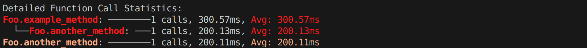

# flexprofiler
[](https://www.python.org)
[](https://pypi.org/project/flexprofiler/)
[](https://pypi.org/project/flexprofiler/)


## 🚀 About

A flexible profiling utility for Python.

## 📦 Installation

```bash
pip install flexprofiler
```
## :computer: Usage
A lightweight summary showing the most common ways to use flexprofiler.

Basic concepts:

- `@track()` - decorate a function to collect call counts and timing statistics. Args:
    - `lines`: boolean, collect per-line timing inside the function.
- `@track_all()` - Decorate a class to profile all its methods. Args:
    - `max_depth`: integer, how deep to recursively profile composed objects (default: 10).
    - `include`: list of method names to track (default: None to track all).
    - `exclude`: list of method names to skip (default: None to skip none).
    - `arg_sensitive`: list of method names to track argument values (default: None).
- `stats()` - print aggregated profiling statistics (function-level and, when enabled, line-level). Args:
    - `unit`: the time unit to use for displaying statistics (default: "ms").
    
---

## ⬇️ Examples

### 1. Tracking a Simple Function

```python
import time
from flexprofiler import stats, track

@track()  # Use @track() decorator to profile the function
def simple_func():
    time.sleep(0.1)

simple_func()
simple_func()

stats() # display the profiling statistics
```

output:


### 2. Tracking All Methods in a Class

```python
import time
from flexprofiler import track_all, stats

@track_all()  # Use @track_all() decorator to profile all methods in the class
class Foo:
    def example_method(self):
        self.another_method()
        time.sleep(0.1)
    def another_method(self):
        time.sleep(0.2)

Foo().example_method()
Foo().another_method()

stats()
```

output:



### 3. Tracking All Methods in a Class Recursively

```python
import time
from flexprofiler import track_all, stats

@track_all(max_depth=3)
class Foo:
    def __init__(self):
        self.sub_class = Bar()
    def example_method(self):
        self.another_method()
        time.sleep(0.1)
    def another_method(self):
        time.sleep(0.2)
    def calling_subclass_method(self):
        for i in range(3):
            self.sub_class.subclass_method_1()
            self.sub_class.subclass_method_2()
            self.sub_class.subclass_method_3()

class Bar:
    def subclass_method_1(self):
        time.sleep(0.05)
    def subclass_method_2(self):
        self.a()
        self.b()
    def subclass_method_3(self):
        self.a()
        self.b()
    def a(self):
        time.sleep(0.02)
    def b(self):
        time.sleep(0.01)

obj = Foo()
obj.example_method()
obj.calling_subclass_method()

stats()
```

output:


### 4. Track All lines in a function

```python
import time
from flexprofiler import track, stats


@track(lines=True)  # with line tracking
def bar(n):
    total = 0
    for i in range(n):
        total += i
        if i % 2 == 0:
            time.sleep(0.001)
        else:
            time.sleep(0.0005)
    return total

@track()  # no line tracking
def baz():
    time.sleep(0.1)

@track()  # no line tracking
def foo():
    for _ in range(3):
        bar(50)
    baz()

foo()
stats()  # display the profiling statistics
```

outputs:


## 🤝 Feedback and Contributions

Contributions, suggestions, and feedback are welcome! Feel free to open issues or submit pull requests on [GitHub](https://github.com/arthurfenderbucker/flexprofiler).

## Author
Arthur Fender C Bucker

[](https://arthurfenderbucker.github.io/)

